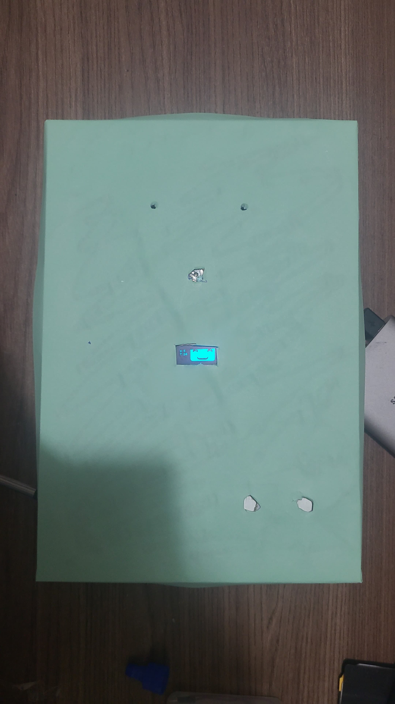

# Tamagotchi 

## Introdução

A ideia é desenvolver um brinquedo interativo onde a criança se torne responsável por cuidar de um bichinho virtual para que ele tenha uma vida saudável. Por exemplo, de forma randômica, o bichinho virtual sentirá calor, frio, carência, entediado, sede e fome, solicitando à criança uma determinada ação de acordo com a necessidade do bichinho.

O brinquedo, porém, tem sensores próprios de temperatura ambiente e batimento cardíaco que permite o envio de informações para os pais, de forma que os pais podem atuar caso a criança esteja em um ambiente de risco, como por exemplo, caso a temperatura onde a criança esteja brincando esteja muito baixa, será enviado um email aos pais informando a temperatura lida e solicitando a verificação dos mesmos se a criança está agasalhada. Esta iteração com os pais não foi implementada a tempo, ficando para trabalhos futuros.

Funcionalidades para os pais:
+ reage à temperatura (sensor de temperatura na parte superior do tamagotchi - não implementado);
+ manda informações para os pais caso o ambiente esteja "insalubre" - não implementado;
+ medicao de batimento cardíaco (envia para os pais os batimentos cardíacos da criança - não implementado);
+ site para os pais acompanharem as informações do tamagotchi (registros com a data do arquivo, informações de temperatura e batimento cardíaco de acordo com um horário determinado).
 
Funcionalidades para a criança:
+ tela (rosto triste = tamagotchi está com fome, sede, frio ou calor. Rosto feliz = tamagotchi sem problemas);
+ Sentimentos do tamagotchi: Frio, Calor, Fome, sede, carência e tédio.
+ Tamagotchi morre.
O brinquedo funciona de forma offline e salva todos os eventos para envio para os pais quando houver rede.

## Lista de partes

+ 1 Sensor de batimento cardíaco;
+ 2 sensores de temperatura (um para a parte lúdica e outro para aviso aos pais);
+ 2 botões digitais (um de alimentação e um de água);
+ Placa MPU-9250 de Acelerômetro e Giroscópio 3 eixos;
+ Tela OLED SSD1306 (128px 64px);
+ 2 leds;
+ 1 caixa para o protótipo;
+ ESP32;
+ jumpers;
+ 2 resistores;
+ 2 protoboards.

## Programas usados

+ Arduino  IDE;
+ Plug-in para fazer upload dos arquivos (https://github.com/lorol/arduino-esp32fs-plugin);
+ GIMP;
+ Autocad.

## Montagem (com fotos)
Nota1: Usaremos a numeração dos pinos de acordo com o GPIO correspondente e que não batem com a ordem em que os pinos são distribuídos fisicamente nas placas de desenvolvimento.
Nota2: Usaremos o termo GPIO mesmo que o pino esteja sendo usado para outros fins como , por exemplo, iremos designar o pino correspondente ao Touch 9 como GPIO 32 que é como ele está organizado na placa DOIT DEVKIT V1.
Nota3: GN e VCC referem-se respectivamente a um dos dois pinos GN e o pino VCC do esp32 e as trilhas da protoboards e/ou jumpers ligados a eles.
Nota4: A menos que seja explicitamente dito considere que os pinos positivos estejam ligados ao VCC e os pinos negativos ao GN.
Utilizamos uma caixa de embalagem de produto eletrônicos pois possuí:
+ espaço suficiente para os fios e sensores;
+ paredes espessas bem rígidas para o transporte do esp32, sensores e fios;
+ levaza do material;
+ resistência do material;
+ simples de cortar;

 

Usamos 1,5 protoboards (uma delas cortado ao meio) para:
1. fixar o esp32 no fundo da caixa aproveitando-se do fato de que as protoboards já vieram com adesivo;
2. melhor aproveitar os 30 pinos (15 pinos de cada lado) disponibilizados pela placa de desenvolvimento DOIT DEVKIT V1;
3. 9 pinos são inutilizados pelo fato de usarmos WiFi (não está claro da documentação do esp32 por que o uso do WiFi/Bluetooth desabilita os pinos associados ao ADC2);
4. 16 pinos estarão disponíveis para os componentes dos quais 4 são de apenas de entrada (input), ou seja, estes 4 não poderão ser usados para componentes que necessitem de comunicação bidirecional.


O resistor de 10 kOhms foi ligado ao fio/pino de dados (DQ - dados bidirecionais) dos sensores de temperatura (ds18b20) e ao VCC para estabelecer um PULLUP no pino GPIO 33 , ou seja, de um lado do resistor temos GPIO 33 e os dois DQ e do outro lado o VCC.
Além do DQ cada um dos sensores possui um fio/pino negativo e um fio/pino positivo.

O resistor de 200 Ohms está ligado ao GN e aos dois leds verdes (olhos). Os leds estão ligados aos pinos GPIO 32 e GPIO 23.

O sensor de batimentos cardíacos possui 3 pinos:
+ negativo;
+ positivo
+ de dados está ligado ao GPIO 36;

O acelerômetro (MPU 9250) e a Tela Oled possuem ambos 4 pinos:
+ negativo;
+ positivo;
+ SDA ambos ligados ao GPIO 21;
+ SCL ambos ligados ao GPIO 22;
+ Ambos os sensores podem compartilhar os pinos graças ao protocolo I2C (lê-se eye-squared-see);

Os dois botões capacitivos possuem 3 pinos:
+ negativo
+ positovo
+ sinal digital ligados ao GPIO 39 e GPIO 34

O esp32 receberá a energia através de sua entrada USB de uma bateria.

 
 
## Operação - Funcionamento do brinquedo

1. Lúdico (interação criança - tamagotchi):

Ao ligar o brinquedo, o brinquedo solicita a medição dos batimentos cardíacos da criança (não randômico, somente quando liga), o sensor de batimento cardíaco está localizado no nariz do tamagotchi. Após a medição dos batimentos cardíacos, o brinquedo tem de forma randômica algumas das sensações abaixo, exigindo interação da criança com o brinquedo: 
+ Ficar com frio: Aquecer o tamagotchi (criança aquece o sensor de temperatura até um determinado delta de temperatura);
+ Ficar com calor: Abanar ou assoprar o sensor de temperatura (criança tenta resfriar o sensor de temperatura por um determinado período de tempo. Se o sensor de temperatura estiver na temperatura ambiente, esta comparação será feita com o outro sensor de temperatura, se a diferença for menor do que 2ºC, será considerado que o tamgotchi já não está mais com calor)
+ Ficar com fome: Alimentar o tamagotchi (criança aperta um botão de alimentação)
+ Sentir sede: Dar água para o tamagotchi (criança aparta um botão de água)
+ Sentir carente: Criança se conecta ao tamagotchi através do sensor de batimento cardíaco (nariz do tamagotchi), os leds que representam os olhos do tamagotchi piscam de acordo com o batimento cardíaco da criança.
+ Sentir tédio: criança movimenta o acelerômetro para entreter o tamagotchi

2. (Não implementado) Monitoramento do ambiente para os pais (interação ambiente -> criança -> pais):
+ Temperatura alta/baixa, umidade alta/baixa, batimento cardíaco baixo/alto => aviso aos pais utilizando o wi-fi para verificar o ambiente da criança. Adicionalmente, para o brinquedo e mostra na tela do brinquedo um sinal para a criança procurar os pais em conjunto com um sinal sonoro.

## Histórico e método de desenvolvimento (Requisitos do projeto)

O projeto foi se desenvolvendo em etapas, conforme abaixo:
- Entender o funcionamento do ESP32;
- Instalar uma IDE para programação do ESP32;
- Implementar uma lógica para captar a temperatura do ambiente a cada segundo;
- Implementar o sensor de batimentos cardíacos e ler na tela do computador;
- Testar a implementação de um botão digital, a ser utilizado na disponibilização de comida e de água;
- Implementar o acelerômetro;
- Apresentar expressões na tela do OLED SSD1306;
- Testar o acendimento do led para utilização como os olhos do tamagotchi.
- Desenvolvimento do protótico;
- Integração dos sensores no protótipo;
- Desenvolvimento de interface web para acessar o log de utilização do tamagotchi pela criança. Esta interface utiliza a rede wi-fi.

## Detalhes de Implementação
### passos para a primeira execução

1. Primeiramente deverá ser criado uma arquivo chamado senhadowifidecasa.h que deverá ser preenchido com o conteúdo:
    ```
    const char *ssid = "Nome do WiFi";
    const char *password = "Senha do WiFI";
    ```
2. Deverá ser selecionado a placa ESP32 Dev Module (esp32);
3. Em 'partition scheme' deverá ser selecionado 'No OTA (2MB APP/2MB SPIFFS);
4. Fazer o upload do código compilado;
5. Acessar através do browser o endereço petdigitalcfa.local/edit o qual irá mostrar os logs.
6. Caso apareça uma página em branco as possíveis soluções são:
    1. No terminal Linux entrar na pasta 'data' e executar o seguinte comando:
        ```
        for file in `ls -A1`; do curl -F "file=@$PWD/$file" petdigitalcfa.local/edit; done
        ```
    2. Utilizar a ferramenta esp32fs em https://github.com/lorol/arduino-esp32fs-plugin
        1. esta ferramente funciona apenas no Arduino IDE 1.8.x (legado)
        2. baixe o arquivo .zip e desempacote-o no caminho (Linux): $HOME/Arduino/tools/ESP32FS/tool/
        3. Abra a sketch na IDE 1.8.x
        4. No menu Ferramentas (Tools) procure por ESP32 Sketch Data Upload
        5. Escolha SPIFFS

Nota: Aparentemente SPIFFS foi descontinuado o que o tornará obsoleto dando lugar ao seu sucessor LittleFS.

### Algumas recomendações para futuros alunos

1. Se for utilizar o Arduino IDE recomendo que aprendam C++ que é a linguagem usada no compilador;
2. Apesar de o Arduino IDE ser mais amigável para iniciantes do esp32 recomendo que usem extensões do Visual Studio Code como o ESP-IDF ou o PlatformIO e incluam o Arduino Core em seu projetos para assim utilizar tanto as funções quanto as bibliotecas do Arduino no esp32.
